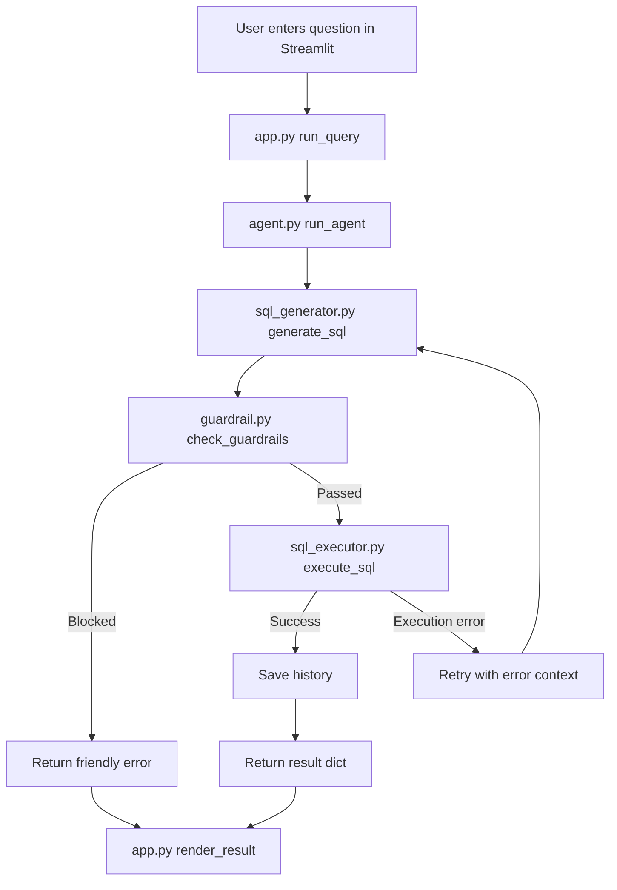
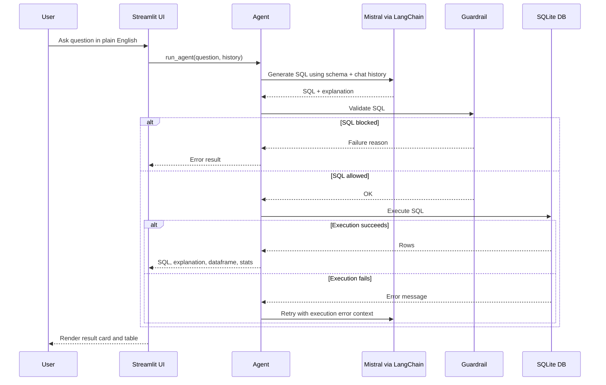
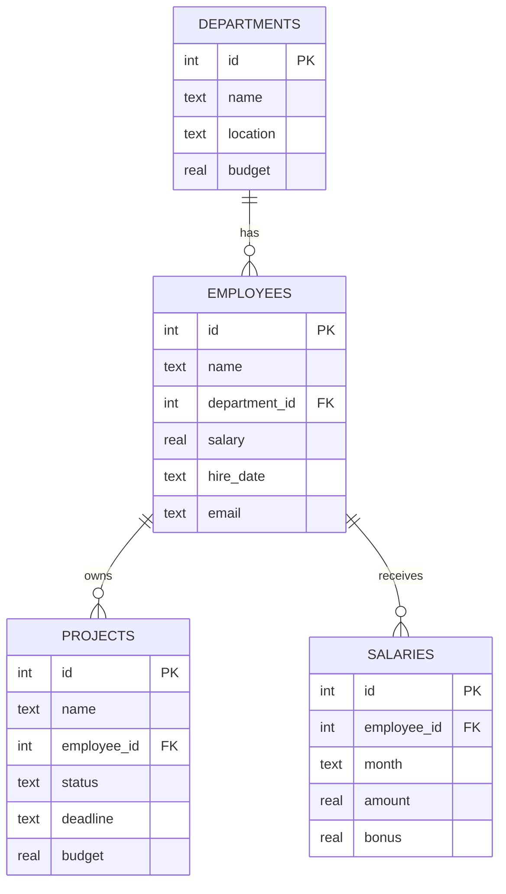

# NL-to-SQL Agent

This project is a Streamlit-based natural-language-to-SQL assistant for a small SQLite company database. A user asks a question in plain English, the app sends the request to Mistral through LangChain, validates the generated SQL with guardrails, executes the query on `company.db`, and shows both the SQL and the result table in the UI.

## What this project does

- Converts business questions into SQLite `SELECT` queries.
- Uses conversational history so follow-up questions can work across turns.
- Blocks unsafe or suspicious SQL before it reaches the database.
- Retries SQL generation when execution fails, feeding the database error back to the LLM.
- Presents results in a styled Streamlit chat interface with query metadata and schema visibility.

## Project structure

```text
nl-sql-agent/
├── app.py              # Streamlit UI and session handling
├── agent.py            # Main orchestration pipeline
├── sql_generator.py    # LangChain + Mistral prompt and SQL parsing
├── guardrail.py        # SQL safety validation
├── sql_executor.py     # SQLite execution via pandas
├── schema_context.py   # Extracts DB schema text for the prompt
├── chat_history.py     # Conversation memory wrapper
├── database.py         # Rebuilds and seeds the SQLite database
├── company.db          # Seeded SQLite database
├── test_agent.py       # CLI-style multi-turn smoke test
├── requirements.txt    # Python dependencies
├── .env                # Local environment variables
├── __pycache__/        # Python bytecode cache
└── venv/               # Local virtual environment
```

## Core architecture

### 1. User interface

`app.py` is the entrypoint for the Streamlit application. It:

- configures the page and custom styling
- initializes session state for messages and chat memory
- renders previous questions and agent responses
- exposes suggested prompts and a free-text input
- shows live schema info in the sidebar
- calls `run_agent()` whenever the user submits a question

### 2. Agent orchestration

`agent.py` is the control center. For each question it:

1. reads the current chat history
2. generates SQL and explanation with `sql_generator.py`
3. validates SQL with `guardrail.py`
4. executes SQL with `sql_executor.py`
5. retries up to `MAX_RETRIES = 2` if execution fails
6. stores successful conversation turns in memory
7. returns a normalized result object to the UI

### 3. SQL generation

`sql_generator.py` builds a LangChain pipeline once at import time:

- `ChatPromptTemplate`
- `MessagesPlaceholder` for multi-turn memory
- `ChatMistralAI(model="mistral-large-latest")`
- `StrOutputParser`

The system prompt includes the schema from `schema_context.py` and strict output instructions:

- only generate `SELECT` queries
- always return `SQL:` and `EXPLANATION:`
- use SQLite syntax
- fix prior execution errors when retrying

### 4. Guardrails

`guardrail.py` blocks risky or malformed queries before execution. It checks:

- empty SQL
- destructive keywords such as `DROP`, `DELETE`, `UPDATE`, `INSERT`
- multiple statements separated by semicolons
- access to SQLite system tables such as `sqlite_master`
- excessive query length

Note: the explicit “must start with `SELECT`” check is currently commented out in code, even though the prompt instructs the model to return only `SELECT` queries.

### 5. SQL execution

`sql_executor.py` executes validated SQL against `company.db` with `pandas.read_sql_query()`. It returns:

- success flag
- DataFrame
- execution time
- row count
- raw execution error, if any

### 6. Conversation memory

`chat_history.py` stores each successful user question as a `HumanMessage` and each raw LLM response as an `AIMessage`. That list is passed back into the LangChain prompt for follow-up questions.

## End-to-end flow



## Sequence diagram



## Database schema

The project uses a seeded SQLite database with four business-oriented tables:

- `departments`: 8 rows
- `employees`: 20 rows
- `projects`: 20 rows
- `salaries`: 120 rows

### Entity relationship view



### Table details

#### `departments`

Stores department-level metadata:

- `id`
- `name`
- `location`
- `budget`

#### `employees`

Stores employee records and links each employee to one department:

- `id`
- `name`
- `department_id`
- `salary`
- `hire_date`
- `email`

#### `projects`

Stores projects assigned to employees:

- `id`
- `name`
- `employee_id`
- `status`
- `deadline`
- `budget`

#### `salaries`

Stores monthly salary history and bonus data per employee:

- `id`
- `employee_id`
- `month`
- `amount`
- `bonus`

## File-by-file explanation

### `app.py`

Responsibilities:

- defines the Streamlit page
- applies custom CSS styling
- manages session state
- renders user questions and agent responses
- exposes example prompts
- displays database schema in the sidebar

Key functions:

- `render_result(result)` renders success and error responses
- `run_query(question)` sends a question through the agent pipeline
- `new_conversation()` resets chat history and visible messages

### `agent.py`

Responsibilities:

- coordinates generation, validation, execution, and retry logic
- handles error formatting
- stores successful turns in conversation memory

Important behavior:

- retries failed SQL execution up to two times
- does not retry if the guardrail blocks the query
- returns a consistent result dictionary used by both UI and tests

### `sql_generator.py`

Responsibilities:

- loads the Mistral API key from `.env`
- builds the prompt chain
- injects schema and chat history into each request
- parses raw LLM output into SQL and explanation

Important behavior:

- builds the chain once at import time
- appends execution error context during retries
- falls back to regex extraction if fenced SQL is missing

### `guardrail.py`

Responsibilities:

- prevents destructive SQL and suspicious input from reaching the database

Important behavior:

- blocks system-table access
- prevents multi-statement execution
- enforces a maximum query length

### `sql_executor.py`

Responsibilities:

- runs validated SQL against SQLite
- returns structured execution metadata

Important behavior:

- uses pandas for clean tabular results
- always closes the database connection

### `schema_context.py`

Responsibilities:

- reads the live SQLite schema
- converts tables, columns, and foreign keys into prompt-friendly text

Important behavior:

- introspects the database using `PRAGMA`
- is used at import time by `sql_generator.py`

### `chat_history.py`

Responsibilities:

- stores conversation turns for multi-turn context
- exposes `clear()`, `get_history()`, and debug-friendly `summary()`

### `database.py`

Responsibilities:

- drops old tables
- recreates schema
- seeds deterministic demo data
- prints row counts and sample previews

Important behavior:

- uses `Faker` and `random.seed(42)` for reproducible sample data
- creates 8 departments, 20 employees, 20 projects, and 6 salary rows per employee

### `test_agent.py`

Responsibilities:

- runs a simple multi-turn smoke test from the command line

What it verifies:

- single-turn SQL generation
- execution path
- conversation memory for a follow-up question

## Setup

### Prerequisites

- Python 3.10+
- A Mistral API key

### Install dependencies

```bash
pip install -r requirements.txt
```

### Configure environment variables

Create or update `.env`:

```env
MISTRAL_API_KEY=your_mistral_api_key_here
```

## Running the project

### 1. Rebuild the database

Run this if you want to regenerate `company.db` from scratch:

```bash
python database.py
```

### 2. Launch the Streamlit UI

```bash
streamlit run app.py
```

By default Streamlit opens the app locally at `http://localhost:8501`.

### 3. Run the CLI smoke test

```bash
python test_agent.py
```

## Example questions

- How many employees are in each department?
- List all projects that are overdue.
- Which department has the highest average salary?
- Show employees hired after January 2023.
- From those employees, who has the highest salary?

## Data flow details

### Prompt construction

The model receives:

- a system instruction containing the schema
- prior chat history
- the latest user question
- optional execution-error feedback on retries

### Retry loop

If generated SQL passes guardrails but fails at runtime:

1. the database error is captured
2. the error is appended to the next LLM prompt
3. the model gets another chance to fix the SQL
4. the loop stops after two retries

### UI rendering

The UI shows:

- generated SQL
- plain-English explanation
- result DataFrame
- query time
- row count
- retry count
- session history in the sidebar

## Dependencies

`requirements.txt` includes:

- `faker`
- `langchain`
- `langchain-mistralai`
- `python-dotenv`
- `pandas`
- `tabulate`

`app.py` also imports `streamlit`, so make sure Streamlit is installed in your environment if it is not already present.

## Current limitations

- The guardrail’s strict “query must start with `SELECT`” check is currently commented out.
- The project is tightly coupled to SQLite and the specific `company.db` schema.
- There are no formal unit tests yet; `test_agent.py` is a smoke test script.
- `sql_generator.py` builds the chain at import time, which makes startup dependent on environment correctness.

## Future improvement ideas

- Re-enable the explicit `SELECT`-only guardrail check.
- Add unit tests for parsing, guardrails, and retry logic.
- Move configuration such as model name, retries, and DB path into environment variables.
- Add schema caching or structured schema serialization.
- Add support for other SQL dialects and databases.

## Quick summary

This repository is a compact, educational NL-to-SQL system with:

- a polished Streamlit frontend
- a LangChain + Mistral SQL generator
- safety validation before execution
- SQLite-backed analytics queries
- multi-turn memory for conversational follow-ups

It is a good starting point for learning how LLM-driven database assistants are stitched together from prompt engineering, guardrails, execution, and UI.
